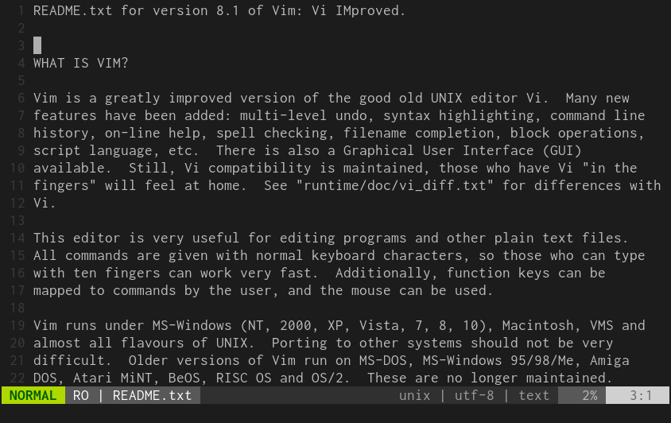

# popupdict.vim

Pop-up Japanese translation under a cursor.



## Requirements

- Vim 8.1.1467
- +popupwin

## Installation

```
Plug 'kis9a/popupdict.vim'
```

## Usage

Example
```
nnoremap gh :PopupDictionary<CR>
nnoremap gl :CommandlineDictionary<CR>
nnoremap <Leader>gh :ToggleCursorPopupDictionary<CR>
```

## Variables

| name              | default | description                     |
|---                |---      |---                              |
| `g:popup_enabled` | `1`     | `1` to enable pop-up dictionary |
| `g:popup_width`   | `60`    | width of a pop-up               |

## Dictionary sources

- https://github.com/kujirahand/EJDict
- https://github.com/monolithpl/verb.forms.dictionary

## LICENSE

MIT
